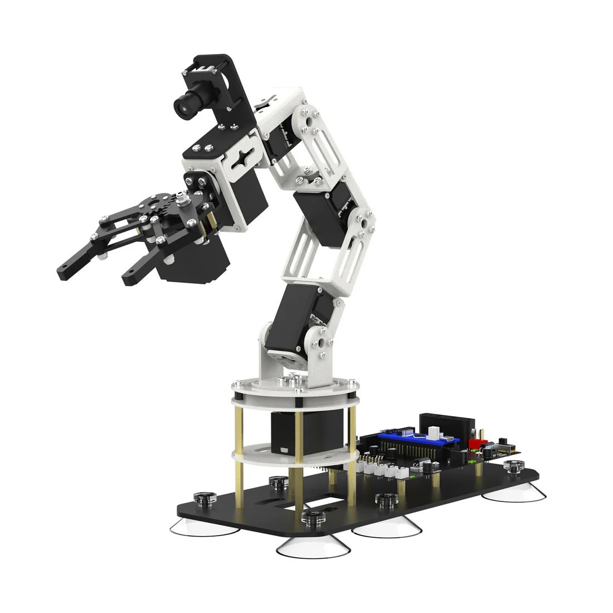

# DOFBOT-SE Control Suite
[Buy the DOFBOT-SE from Yahboom](https://category.yahboom.net/products/dofbot-se?srsltid=AfmBOophgV9sLxIVlWKlYBEeO8n5Gbtx1hqm2wIYEDh1uMDu2t9Afowh)



## Overview
This repository bundles ready-to-run Python and C++ demos for the Yahboom DOFBOT-SE robotic arm. Each script exposes command-line options so teammates without robotics or programming experience can move joints, trigger the buzzer, and run showcase routines with minimal setup.

## Repository Layout
- `dofbot_python/`: PySerial-based helpers and demo scripts.
- `dofbot_c++/`: C++17 equivalents using POSIX serial APIs.
- `images/`: Product media used in this README.

## Hardware Setup
1. Connect the DOFBOT-SE control board to your computer via USB.
2. Identify the serial device:  
   - **macOS:** `ls /dev/cu.*` (the board usually appears as `/dev/cu.usbserial-xxxx`).  
   - **Linux:** `ls /dev/ttyUSB*` or `ls /dev/ttyACM*` to find the correct port.
3. Grant permission to access the device:
   - **Linux (dialout group):**
     ```bash
     whoami
     sudo usermod -a -G dialout $USER
     ```
     Log out and back in (or reboot), then verify with `groups`.
   - **macOS:** running the scripts with your current user is typically sufficient; if you hit a “permission denied” error, prepend commands with `sudo`.
4. The detected port will be passed to every script via the `--port` option.

## Python Quick Start
1. Install Python 3.8+ (pip is included by default).
2. Optional but recommended: create and activate a virtual environment.
3. Install the Yahboom driver locally:
   ```bash
   cd dofbot_python
   sudo python3 setup.py install
   cd ..
   ```
   This installs `pyserial` and the DOFBOT helper library into your active Python environment.
4. Once the arm’s port is known, run any script and pass that port with `--port`.

### Single-Servo Control
```bash
python3 dofbot_python/ctrl_servo.py --port /dev/cu.usbserial-2130 --servo-id 3 --angle 120 --move-time 600
```
- `--servo-id`: which joint to move (1 = base … 6 = gripper).
- `--angle`: target angle. Joints 1-4 and 6 accept 0–180°, joint 5 accepts 0–270°.
- `--move-time`: duration in milliseconds (0 = fastest).

### Move All Six Servos Together
```bash
python3 dofbot_python/ctrl_servo.py --port /dev/cu.usbserial-2130 --angles 90 80 70 60 50 40 --move-time 1000
```
Angles are ordered S1 → S6 using the limits listed above.

### Additional Python Demos
| Script | Description | Example |
| --- | --- | --- |
| `beep.py` | Exercise the onboard buzzer | `python3 dofbot_python/beep.py --port /dev/cu.usbserial-2130` |
| `ctrl_all_servo.py` | Sweep every joint back and forth | `python3 dofbot_python/ctrl_all_servo.py --port /dev/cu.usbserial-2130` |
| `left_right.py` | Left/right base sweep routine | `python3 dofbot_python/left_right.py --port /dev/cu.usbserial-2130` |
| `dance.py` | Extended choreographed motion | `python3 dofbot_python/dance.py --port /dev/cu.usbserial-2130` |
| `read_servo.py` | Continuously report servo angles | `python3 dofbot_python/read_servo.py --port /dev/cu.usbserial-2130` |

Need extra time before sending commands? Add `--init-delay` (in seconds):
```bash
python3 dofbot_python/dance.py --port /dev/cu.usbserial-2130 --init-delay 0.2
```

## C++ Quick Start
1. Install CMake (3.10+) and a C++17-capable compiler.
2. Build the demos:
   ```bash
   cd ~/dofbot_c++/
   mkdir build
   cd build
   cmake ..
   make
   ```
3. Run any executable from the `build/` directory, supplying the same arguments as the Python scripts.

### Single-Servo Example
```bash
./build/ctrl_servo --port /dev/cu.usbserial-2130 --servo-id 6 --angle 150 --move-time 700
```

### Six-Servo Example
```bash
./build/ctrl_servo --port /dev/cu.usbserial-2130 --angles 90 80 70 60 50 40 --move-time 1000
```

### Other Executables
| Binary | Purpose | Example |
| --- | --- | --- |
| `beep` | Buzzer demonstration | `./build/beep --port /dev/cu.usbserial-2130` |
| `ctrl_all_servo` | Continuous sweep of all joints | `./build/ctrl_all_servo --port /dev/cu.usbserial-2130` |
| `dance` | Choreographed routine | `./build/dance --port /dev/cu.usbserial-2130` |
| `left_right` | Base left/right sweep | `./build/left_right --port /dev/cu.usbserial-2130` |
| `read_servo` | Live angle feedback for IDs 1–6 | `./build/read_servo --port /dev/cu.usbserial-2130` |

Use `Ctrl+C` to stop long-running routines; the programs exit cleanly even mid-motion.

## Troubleshooting Tips
- **No movement?** Confirm no other application has the serial port open and that the device path is correct.
- **Permission denied?** On macOS/Linux, add your user to the dialout/tty group or temporarily use `sudo`.
- **Unexpected angles reported?** Calibrate the servos and ensure each ID matches the joint wiring (ID 1 = base, ID 6 = end effector).

## Author

Sandesh Athawale<br>
Currently based in Tokyo, Japan 🇯🇵 and working as a System engineer.
